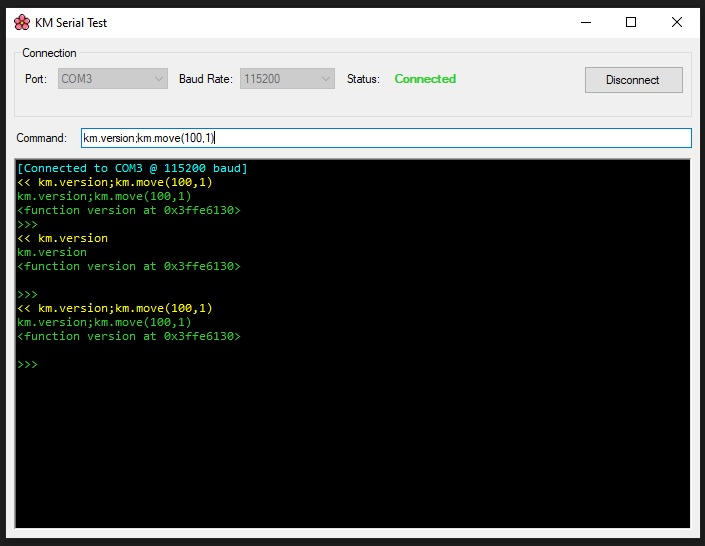

# KM Serial Test

A lightweight Windows serial terminal built with C# and WinForms.

## Features

- Auto-refreshing COM port list on dropdown open
- Common baud rate selector (300 – 921600)
- Live connection status indicator
- Color-coded terminal output (`>>` received, `<<` sent)
- Command history navigation with Up / Down arrow keys
- `cls` / `clear` command to wipe the terminal
- Auto-detects device disconnection when USB adapter is unplugged

## Requirements

- Windows
- .NET Framework 4.x
- A serial device or USB-to-serial adapter

## Usage

1. Select a COM port and baud rate from the **Connection** group
2. Click **Connect**
3. Type a command and press **Enter** to send
4. Use **Up / Down** arrow keys to navigate command history
5. Type `cls` or `clear` to wipe the terminal output
6. Click **Disconnect** or unplug the device to end the session
